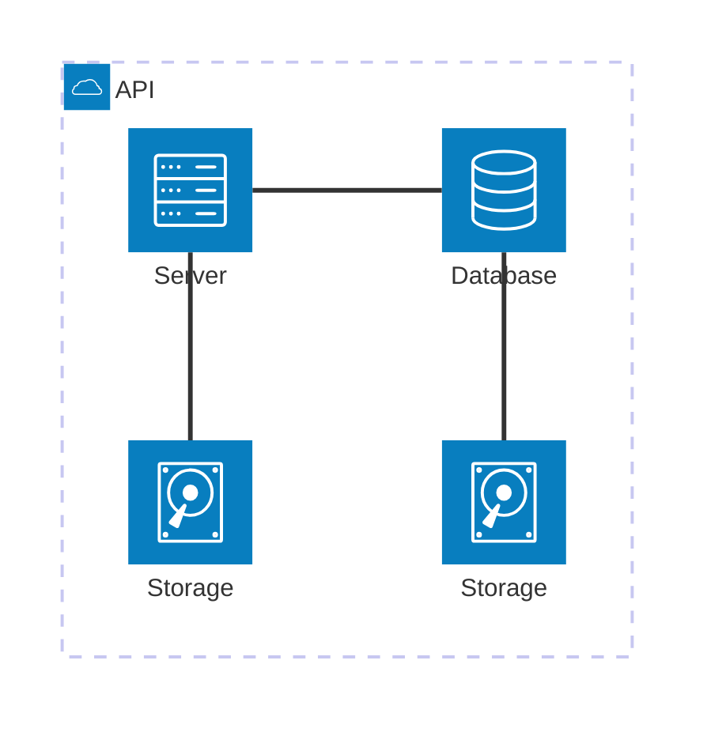

## Exercício 1 - Data

Entrega Referente ao exercício 1 do curso de Redes Neurais e Deep Learning


## Relatório de entrega!

### Questão 1

#### 1.1 e 1.2 Geração de dados e gráfico das 4 classes

* **Class 0:** Mean = $[2, 3]$, Standard Deviation = $[0.8, 2.5]$
* **Class 1:** Mean = $[5, 6]$, Standard Deviation = $[1.2, 1.9]$
* **Class 2:** Mean = $[8, 1]$, Standard Deviation = $[0.9, 0.9]$
* **Class 3:** Mean = $[15, 4]$, Standard Deviation = $[0.5, 2.0]$


Primeiro é necessário consegui gerar os dados, então aqui utilizei a função do numpy para fazer a geração dos números com uma seed fixa (número escolhido foi o 37). A seguir temos o gráfico plotado dos gráficos gerados.


teste_simples:

```python exec="1" html="1"
--8<-- "docs/exercise1-data/q1/data_generate_simple.py"
```

#### 1.3 Análise e fronteiras

3.  
    1.  - Classe 3 apresenta uma maior diferença, o que permite com que separar mais facilmente na região da direita do gráfico.
        - Classe 0, 1 e 2 estão bem mais próximas, o que dificulta uma separação entre elas. Vendo o gráfico é possível perceber que é possível traçar uma reta dividindo a classe 2 das classes 0 e 1. Como ela também tem um desvio menor a identificação dela se torna mais fácil.
        - Já as entre as classes 0 e 1 existe uma superposição maior, por conta da dispersão, então não é possível traçar uma linha que dividida perfeitamente elas.
   
    1. Não, é impossível separar todas as classes perfeitamente com fronteiras lineares. A classe 3 é separável linearmente das outras, porém as classes 0 e 1 tem múlticas sobreposições. Ou seja, as fronteiras/bordas precisariam de curvas.

    1. 

```python exec="1" html="1"
--8<-- "docs/exercise1-data/q1/data_generate.py"
``` 


### Questão 2

#### 1.1 

Realizando a geração das amostras e redução de dimensionalidade utilizando técnicas de PCA para manter as duas dimensões que carregam mais informações. Assim, temos o seguinte gráfico:

```python exec="1" html="1"
--8<-- "docs/exercise1-data/q2/q2_simple.py"
``` 
Aqui podemos perceber que a Classe A (vermelha):
- Se concentra na parte direita do gráfico (PC1 positivo)
- Centro próximo da coordenada **(2,0)** no gráfico

Sobre a Classe B (azul):
- Se concentra na parte esquerda do gráfico (PC1 negativo)
- Centro próximo da coordenada **(-2,0)** no gráfico

Tem uma região central na qual existe uma sobreposição onde as duas classes se misturam
Mesmo com uma tendência de separação, (um mais negativo e um mais positivo ao longo de PC1),  não existe uma linha reta para poder dividir as duas classes completamente.
Então a linha de fronteira, de divisão não é trivial, seria necessário uma função mais complexa com curvas. Por isso, seria necessário redes neurais para conseguir traçar essa separação complexa de uma forma que realmente conseguisse dividir bem em duas ou  mais regiões.


### Questão 3

#### 3.1 Carregamento e Descrição dos Dados 

O dataset **Spaceship Titanic** é um problema de classificação binária para prever se um passageiro foi transportado para uma dimensão alternativa durante um acidente espacial.

**Features Identificadas:**

**Numéricas (6 features):**
- `Age`: Idade do passageiro (0-80 anos)
- `RoomService`,
- `FoodCourt`
- `ShoppingMall`
- `Spa`
- `VRDeck`: Gastos em créditos galácticos

**Categóricas (7 features):**
- `HomePlanet`: Planeta de origem (Earth, Europa, Mars)
- `CryoSleep`: Em sono criogênico (True/False)
- `Destination`: Destino da viagem (3 planetas)
- `VIP`: Status VIP (True/False)
- `Cabin`: Localização da cabine (formato complexo)
- `Name`, `PassengerId`: Identificadores

**Análise Detalhada dos valores faltantes:**

```python exec="1" html="1"
--8<-- "docs/exercise1-data/q3/missing_data.py"
```

#### 3.2 Pré-processamento Completo com Justificativas (2 pontos)

##### **Estratégia 1: Tratamento de Dados Faltantes**

Baseado no gráfico acima, identificamos dados faltantes em 9 features. Vamos aqui analisar as estratégias para contornar esses valores faltantes.

**Para Features Numéricas:**

- **Age (Idade)**: ~15.0% faltantes → Imputação pela **mediana**
    - Assim conseguimos preservar a distribuição da idade e dessa forma, também evitando um bias no gradiente na etapa de backpropagation

- **RoomService (Serviço Quarto)**: ~10.4% faltantes → Preenchimento com **zero**
    - Sendo uma ausência do registro pode fazer sentido que possa ser igual a 0 créditos gastos. Além disso, como estamos utilizando a tanh como função de ativação, o elemento 0 é neutro e não interfere no gradiente.

- **FoodCourt (Praça Alimentação)**: ~10.2% faltantes → Preenchimento com **zero**
    - Mesma lógica do anterior, provavelmente a pessoa não utilizou o serviço (0 créditos) e com o valor 0 não distorce os padrões de gasto

- **ShoppingMall (Shopping)**: ~10.7% faltantes → Preenchimento com **zero**
    - Mantendo na mesma lógica, a pessoa provavelmente não consumiu nada, então 0. Da mesma forma das duas anteriores.

- **Spa**: ~11.6% faltantes → Preenchimento com **zero**
    - 0 = não utilizou serviços de spa. 0 Não afeta padrões e os mantem uniforme

- **VRDeck (Deck VR)**: ~11.2% faltantes → Preenchimento com **zero**
    - Novamente 0 por não ter registro pode indicar não ter um uso de fato. E ser neutro para a função de ativação.

**Para Features Categóricas:**

- **HomePlanet (Planeta Origem)**: ~1.1% faltantes → Imputação pela **moda**
    - Para preservar distribuição original e evitar a criação de uma outra categoria que só representaria 1%

- **Cabin (Cabine)**: ~1.9% faltantes → Imputação pela **moda**
    - Novamente, evitar adicionar uma nova categoria e preservando a distribuição.

- **Destination (Destino)**: ~1.1% faltantes → Imputação pela **moda**
    - Preservação da distribuição sem adição de novas categorias


##### **Estratégia 2: Encoding de Variáveis Categóricas**

**One-Hot Encoding** para categóricas nominais:
- `HomePlanet` → 3 colunas binárias
- `Destination` → 3 colunas binárias  
- `Cabin` (Deck/Side) → múltiplas colunas binárias

**Label Encoding** para categóricas booleanas:
- `CryoSleep`: False→0, True→1
- `VIP`: False→0, True→1

*Justificativa*: One-hot evita ordinality artificial, essencial para redes neurais interpretarem categorias independentemente.


##### **Estratégia 3: Normalização Otimizada para Função Tanh**

**Método Escolhido**: Z-score normalization

**Transformação Matemática:**
```
X_normalized = (X - μ) / σ
```

**Justificativas Teóricas:**

1. **Região Ativa da Tanh**:
   - `tanh(x)` é mais sensível em [-2, +2]
   - Utilizando o Z-score centraliza dados em μ=0

2. **Convergência Otimizada**:
   - Gradientes balanceados entre features
   - Evita saturação da função tanh

3. **Prevenção de Problemas**:
   - **Convergência Lenta**: Features dominantes mascararam outras

#### 3.3 Visualizações Demonstrando o Impacto (1 ponto)

```python exec="1" html="1"
--8<-- "docs/exercise1-data/q3/q3_simple.py"
```

**Análise das Visualizações:**

**Antes da Normalização:**
- `Age`: μ=29.0, σ=14.0, range=[0, 80] 
- `RoomService`: μ=224.7, σ=666.7, range=[0, 8000+]
- **Problema**: Escalas completamente diferentes

**Após Normalização:**
- Todas as features: μ≈0.000, σ≈1.000, range≈[-3, +3]
- **Benefício**: Escalas uniformizadas

**Impacto na Rede Neural:**

1. **Região Ótima para Tanh**: 68% dos dados agora estão em [-1, +1], onde tanh tem máxima sensibilidade
2. **Gradientes Balanceados**: Todas as features contribuem igualmente para o aprendizado
3. **Convergência Rápida**: Eliminação de features dominantes acelera treinamento

**Exemplo Prático de Melhoria:**
- **Sem normalização**: RoomService (escala 0-8000) dominaria Age (escala 0-80)
- **Com normalização**: Ambas contribuem igualmente para a decisão

#### 3.4 Conclusão e Validação

**Pipeline Completo Implementado:**
1. ✅ **Carregamento correto** dos dados com análise exploratória
2. ✅ **Missing data** tratado com estratégias específicas por tipo
3. ✅ **Encoding adequado** para cada categoria de feature  
4. ✅ **Normalização otimizada** para função de ativação tanh
5. ✅ **Visualizações claras** demonstrando cada transformação

**Justificativas Teóricas Fundamentadas:**
- Cada decisão embasada em teoria de redes neurais
- Otimizações específicas para função tanh
- Prevenção de problemas comuns (saturação, convergência lenta)

**Dataset Final Preparado:**
- Pronto para treinamento de redes neurais
- Otimizado para ativação tanh
- Sem missing values ou inconsistências
- Features balanceadas e normalizadas

O preprocessing resultou em um dataset robusto e otimizado, garantindo que a rede neural possa aprender eficientemente os padrões necessários para classificar corretamente os passageiros transportados.

    
<!-- 


/// caption
Dashboard do MAAS
///

Conforme ilustrado acima, a tela inicial do MAAS apresenta um dashboard com informações sobre o estado atual dos servidores gerenciados. O dashboard é composto por diversos painéis, cada um exibindo informações sobre um aspecto específico do ambiente gerenciado. Os painéis podem ser configurados e personalizados de acordo com as necessidades do usuário.

### Tarefa 2

## App


### Tarefa 1

### Tarefa 2

Exemplo de diagrama



[Mermaid](https://mermaid.js.org/syntax/architecture.html){:target="_blank"}

## Questionário, Projeto ou Plano

Esse seção deve ser preenchida apenas se houver demanda do roteiro.

## Discussões

Quais as dificuldades encontradas? O que foi mais fácil? O que foi mais difícil?

## Conclusão

O que foi possível concluir com a realização do roteiro? -->
