## Exercício 1 - Desenvolvimento MLP

#### Desenvolvimento parte 1 (Exercício 1)
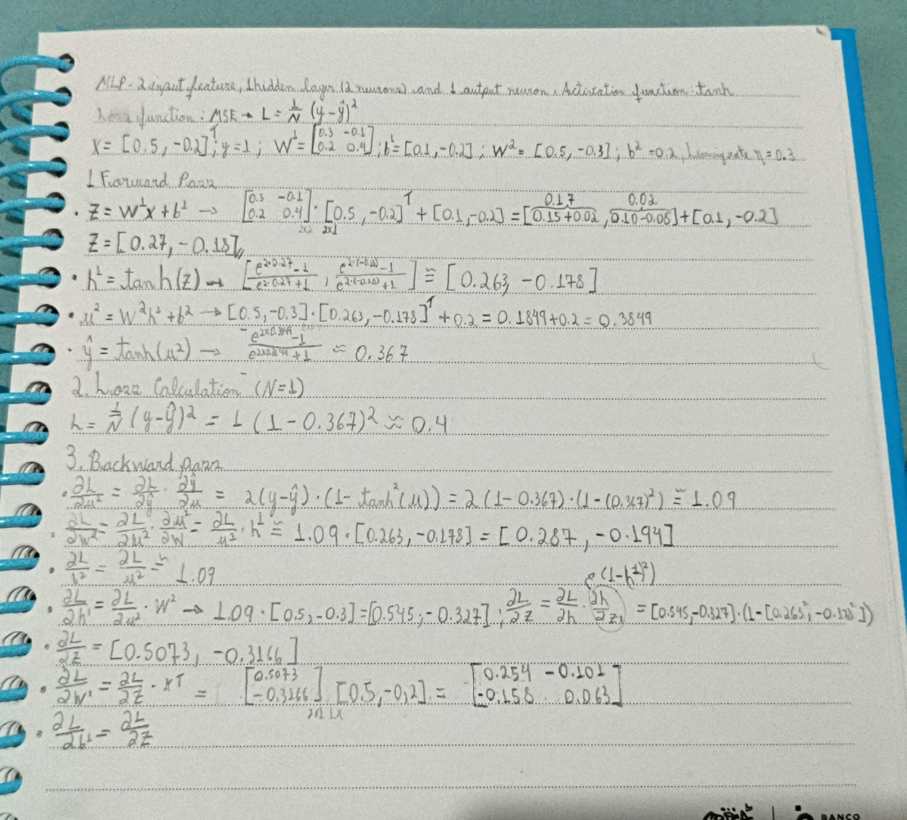

#### Desenvolvimento parte 2 (Exercício 1)
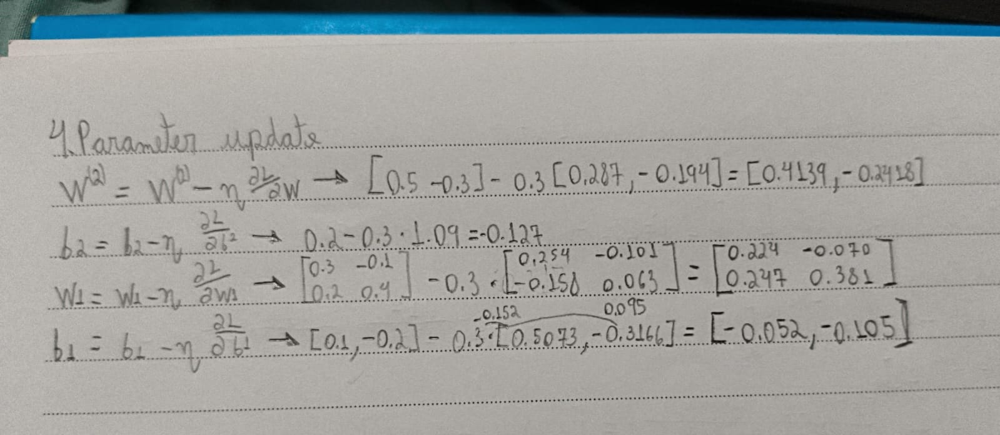

## Exercício 2 — Classificação Binária 


- **Dados**: 1000 amostras, com 1 cluster para a classe 0 e 2 clusters para a classe 1, garantindo um cenário ligeiramente desafiador e separável.

### Geração de Dados (make_classification)
Para realizar a geração de diferente de clusters por classe (1 para a classe 0 e 2 para a classe 1), a função `make_classification` foi utilizada duas vezes:
- 1: `weights=[1.0, 0.0]`, `n_clusters_per_class=1` → gera classe 0, com 1 cluster.
- 2: `weights=[0.0, 1.0]`, `n_clusters_per_class=2` → gera classe 1, com 2 clusters.

Parâmetros principais utilizados:
- `n_features=2`, `n_informative=2`, `n_redundant=0`.
- `class_sep≈1.5–1.6` e `flip_y≈0.01`,
- `random_state/seed=42` 

Após gerar as amostras, os dados são embaralhados, divididos em treino (80%) e teste (20%), e padronizados (média 0, desvio 1) usando apenas as estatísticas do conjunto de treino.

### MLP 

#### Arquitetura
- Entrada: 2 features.
- Camadas ocultas: por padrão, `[16, 16]` neurônios com **ReLU**.
- Saída: 1 neurônio com **sigmoid** para probabilidade da classe 1.

#### Inicialização de Pesos
- Os pesos são inicializados com valores aleatórios pequenos de uma distribuição normal para quebrar a simetria.

#### Funções de Ativação — justificativa
- **ReLU** nas ocultas: simples, eficiente e reduz problemas de gradientes muito pequenos em comparação ao sigmoid/tanh.
- **Sigmoid** na saída: adequada para classificação binária, pois modela P(y=1|x) ∈ (0,1).

#### Função de Perda — justificativa
- **Binary Cross-Entropy (BCE)**: é a perda canônica para classificação binária probabilística. É consistente com a saída sigmoid e fornece gradientes bem comportados.

#### Otimizador — justificativa
- **Descida do Gradiente** (taxa de aprendizado padrão `0.05`): simples, transparente e suficiente para este problema sintético. Taxas diferentes podem ser testadas via CLI para balancear estabilidade e velocidade de convergência.

### Treinamento
- Número de épocas padrão: `300` (ajustável via CLI).
- Monitoramento: perda de treino por época (BCE). Ao final, são gerados gráficos e métricas.

### Avaliação
- **Acurácia** no conjunto de teste (20%).
- **Matriz de confusão** (TP, TN, FP, FN).
- **Fronteira de decisão** em 2D para visualização.

Gráficos salvos na mesma pasta do script:
- `training_loss.png` — curva de perda de treinamento.
- `decision_boundary.png` — fronteira de decisão com pontos de treino e teste.
- `confusion_matrix.png` — matriz de confusão.

Métricas salvas em `metrics.txt`.

### Como Executar (Windows PowerShell)
Requisitos: ambiente Python do projeto (a pasta `env` já contém as dependências, incluindo scikit-learn e matplotlib).

1) Executar o treinamento (parâmetros padrão já definidos no script):
```powershell
.\env\Scripts\python.exe docs\exercise3-MLP\mlp.py
```

2) Após a execução, ver os resultados:
```powershell
Get-Content docs\exercise3-MLP\metrics.txt
```

Arquivos gerados na pasta `docs\exercise3-MLP\`:

#### Distribuição dos Dados
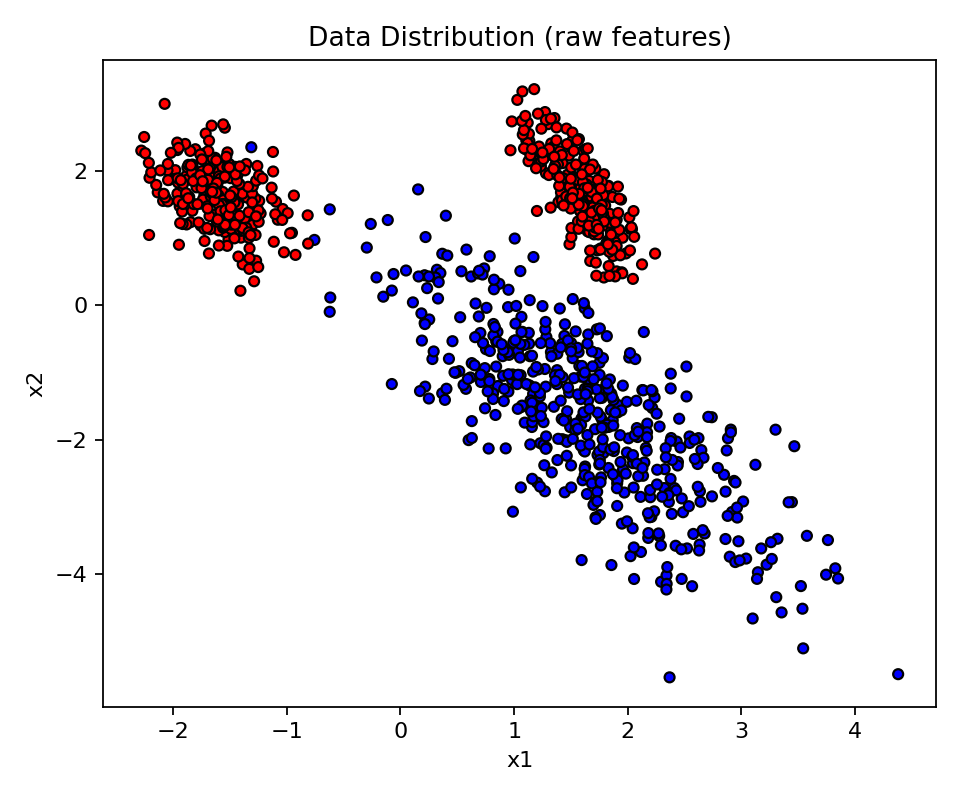

#### Curva de Perda de Treinamento
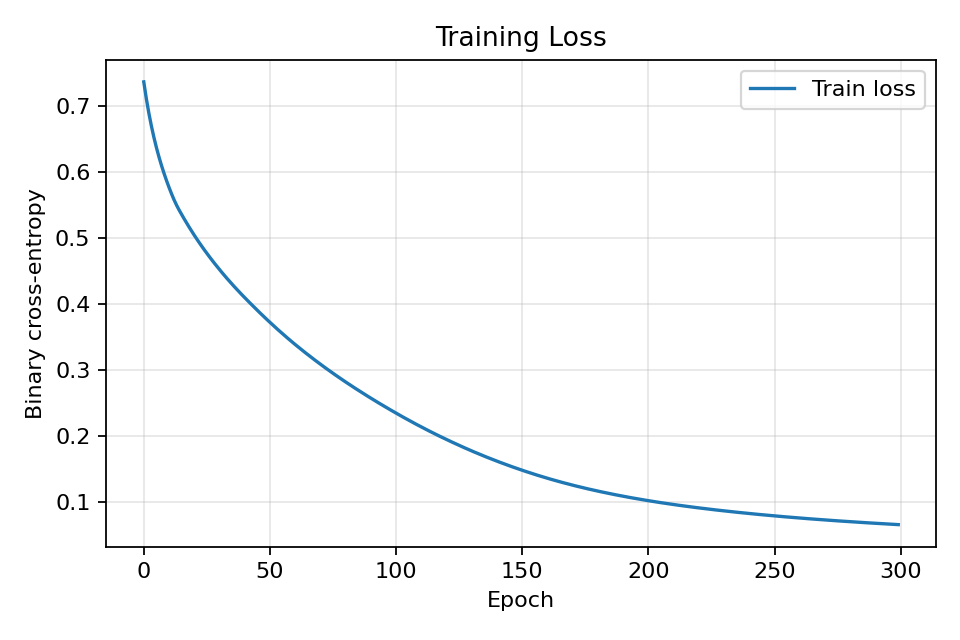

#### Fronteira de Decisão
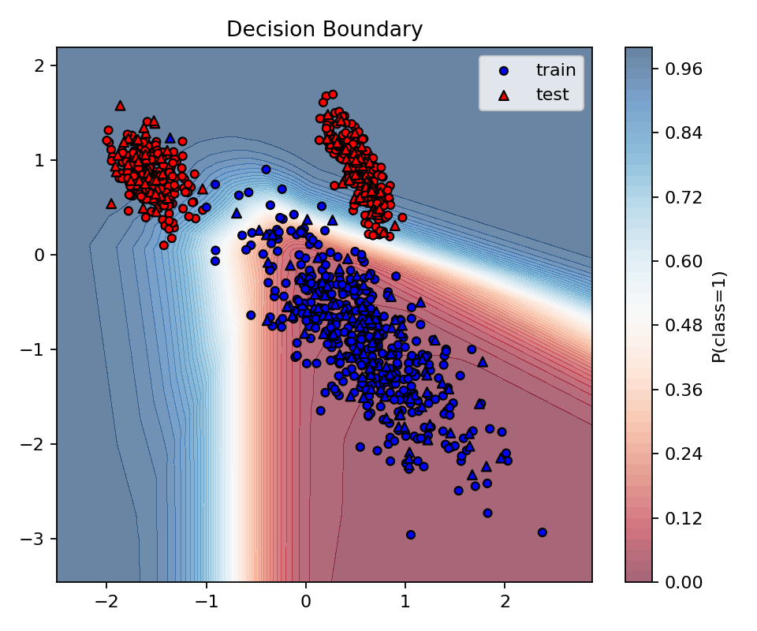

#### Matriz de Confusão
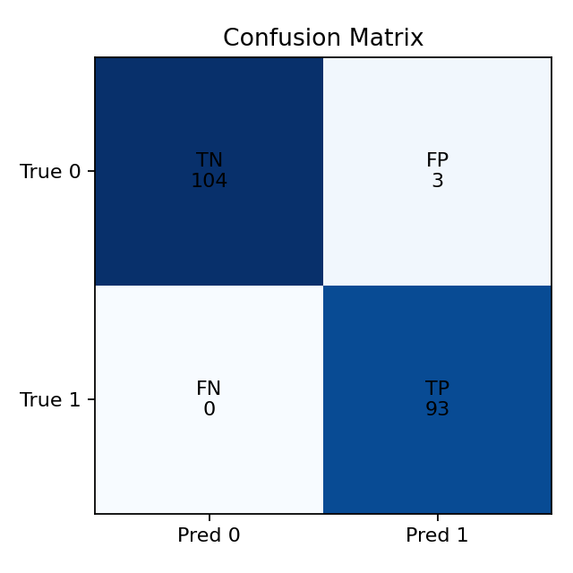

### Resultados Esperados (diretriz)
Com `class_sep` por volta de 1.5–1.6 e `flip_y=0.01`, espera-se que a MLP alcance **acurácia acima de 0.90** no conjunto de teste, mantendo uma fronteira de decisão que respeita as 3 regiões (1 cluster da classe 0 e 2 da classe 1). Valores exatos podem variar com o seed, taxa de aprendizado e número de épocas.

### Reprodutibilidade
- `seed` fixo (padrão 42) em todas as partes do pipeline.
- Padronização feita somente com estatísticas do treino.

### Arquivos e Principais Funções
- Código: `docs/exercise3-MLP/mlp.py`
  - `generate_uneven_cluster_data(...)`: gera 1 cluster para a classe 0 e 2 para a classe 1 combinando duas chamadas de `make_classification`.
  - `MLPBinaryClassifier`: implementação da MLP com forward, backward e update manual.
  - Plots: perda, fronteira de decisão e matriz de confusão.
  - CLI: permite customizar amostras, épocas, lr, camadas ocultas, seed, class_sep, flip_y.

### Conformidade com as Regras do Exercício
- Apenas **NumPy** foi usado para as operações matriciais do modelo (ativação, perda, gradientes e forward/backward foram implementados manualmente).
- `scikit-learn` foi utilizado somente para a geração dos dados (permitido).

### Colaboração com IA
Esta implementação e documentação contaram com suporte de uma IA para acelerar a escrita do código e da análise. Todo o conteúdo foi revisado para garantir entendimento e aderência às regras do exercício.

## Exercício 3 — Classificação Multiclasse com Dados Sintéticos e MLP Reutilizável

Neste exercício, aumentamos a complexidade para 3 classes e 4 features, preservando a filosofia do Exercício 2: a MLP é implementada do zero, reutilizando a mesma estrutura base (apenas adaptando hiperparâmetros e a camada/ loss de saída).

### Geração de Dados (3 classes, clusters desiguais)
Usamos `make_classification` três vezes, uma para cada classe, forçando que cada chamada gere apenas uma das classes (via `weights`) e definindo um número diferente de clusters por classe:
- Classe 0: 2 clusters
- Classe 1: 3 clusters
- Classe 2: 4 clusters

Parâmetros: `n_features=4`, `n_informative=4`, `n_redundant=0`, `class_sep≈1.6`, `flip_y≈0.01`, `seed=42`. As três partes são concatenadas e embaralhadas. Depois, dividimos em treino (80%) e teste (20%) e padronizamos com estatísticas do treino.

### MLP Multiclasse (Reuso do Exercício 2)
- Estrutura idêntica: camadas ocultas com **ReLU**.
- Diferenças necessárias para multiclasse: camada de saída com **softmax** (3 neurônios) e **categorical cross-entropy** como função de perda.
- Otimizador: **Descida do Gradiente** com taxa padrão `0.05` (ajustável via CLI).

Arquitetura sugerida: `[32, 32]` neurônios nas ocultas. Entrada com 4 features, saída com 3 classes.

### Treinamento e Avaliação
- Épocas padrão: `400`.
- Métrica: **acurácia** no conjunto de teste.
- Visualizações:
  - `training_loss_ex3.png` — curva da perda categórica.
  - `pca_scatter_ex3.png` — projeção PCA 2D colorida pela classe verdadeira (treino e teste).
  - `confusion_matrix_ex3.png` — matriz de confusão multiclasse.
- Métricas salvas em `metrics_ex3.txt`.

### Como Executar (Windows PowerShell)
```powershell
.\env\Scripts\python.exe docs\exercise3-MLP\mlp_ex3.py
```

Depois, visualize as métricas:
```powershell
Get-Content docs\exercise3-MLP\metrics_ex3.txt
```

Arquivos gerados:

#### Curva de Perda de Treinamento
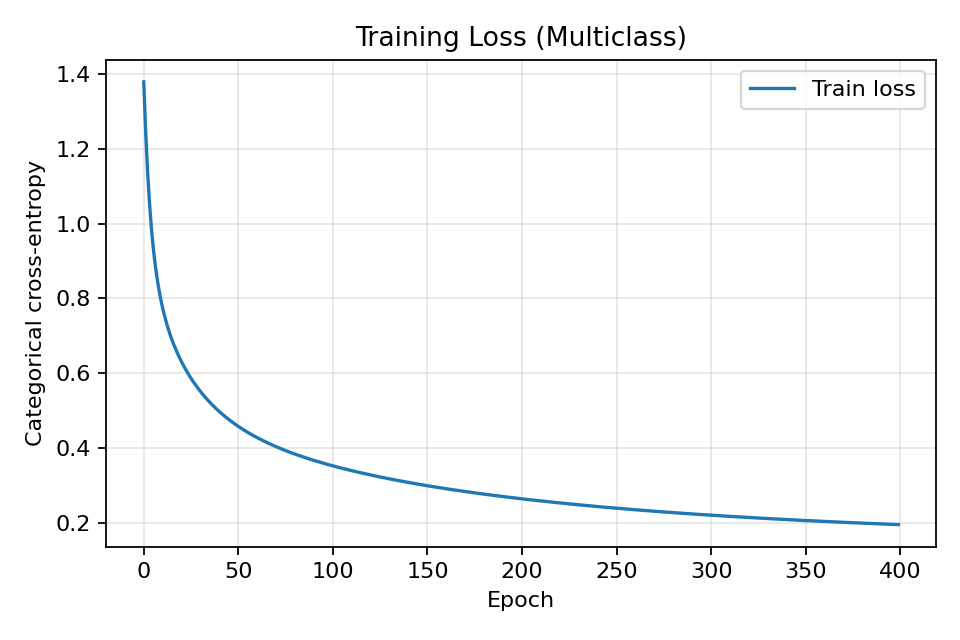

#### Distribuição dos Dados (PCA 2D)
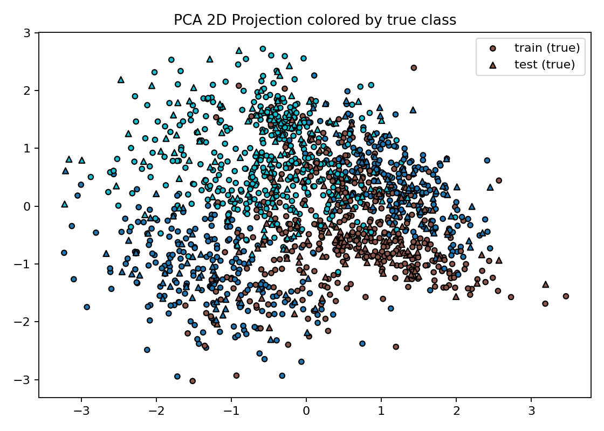

#### Matriz de Confusão
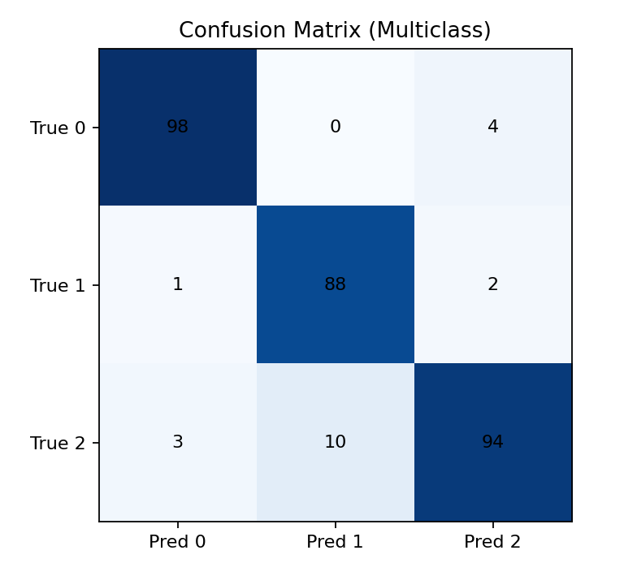

### Resultados Esperados (diretriz)
Com separação moderada (`class_sep≈1.6`) e ruído leve, espera-se **acurácia > 0.85** no teste (varia com seed e hiperparâmetros). A PCA deve mostrar separação razoável entre classes, ainda que com sobreposição em regiões mais difíceis.

### Conformidade e Reuso (Ponto Extra)
- O núcleo da MLP (estrutura, forward/backward, atualização) mantém a mesma forma do Exercício 2, apenas adaptando a camada de saída para softmax e a perda para cross-entropy categórica. Não foram utilizados frameworks de DL; somente **NumPy** para operações matriciais.

## Exercício 4 — MLP Mais Profunda (≥ 2 camadas ocultas)

Neste passo, repetimos o Exercício 3, porém garantindo uma MLP mais profunda, com pelo menos **duas camadas ocultas**. O código reutiliza a mesma implementação do Exercício 3, alterando apenas a configuração de camadas ocultas via CLI.

### Arquitetura
- Entrada: 4 features; Saída: 3 classes (softmax).
- Ocultas: pelo menos 2 camadas (ex.: `[64, 64, 32]`).
- Ativações: **ReLU** nas ocultas e **softmax** na saída.
- Perda: **categorical cross-entropy**; Otimizador: **Gradiente Descendente**.

### Treinamento e Avaliação
- Épocas sugeridas: `450` (ajustável).
- Métrica: **acurácia** no conjunto de teste.
- Artefatos gerados:
  - `training_loss_ex4.png` — curva da perda.
  - `pca_scatter_ex4.png` — PCA 2D colorida por classe verdadeira.
  - `confusion_matrix_ex4.png` — matriz de confusão multiclasse.
  - `metrics_ex4.txt` — resumo de métricas e hiperparâmetros.

### Como Executar (Windows PowerShell)
```powershell
.\env\Scripts\python.exe docs\exercise3-MLP\mlp_ex4.py
```

Em seguida:
```powershell
Get-Content docs\exercise3-MLP\metrics_ex4.txt
```

Arquivos gerados:

#### Curva de Perda de Treinamento
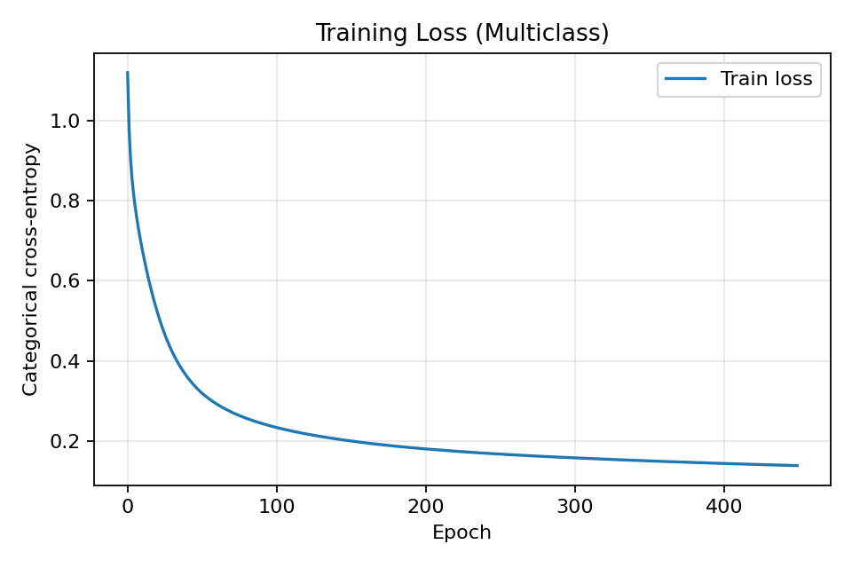

#### Distribuição dos Dados (PCA 2D)


#### Matriz de Confusão
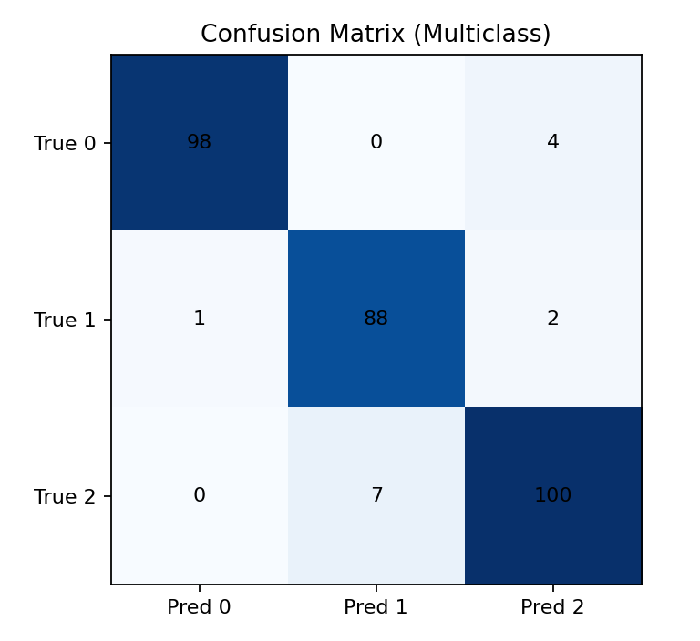

### Observações
- A profundidade extra tende a capturar melhor a variação entre os 2/3/4 clusters por classe, podendo melhorar a acurácia. Entretanto, pode demandar mais épocas ou tuning fino da taxa de aprendizado.


