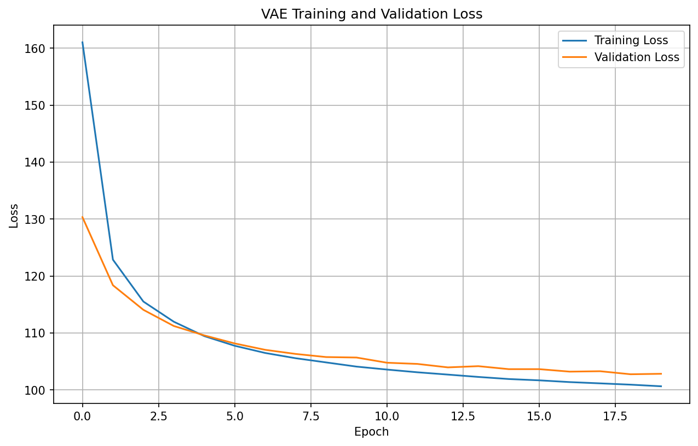
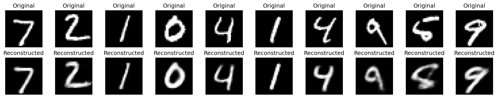
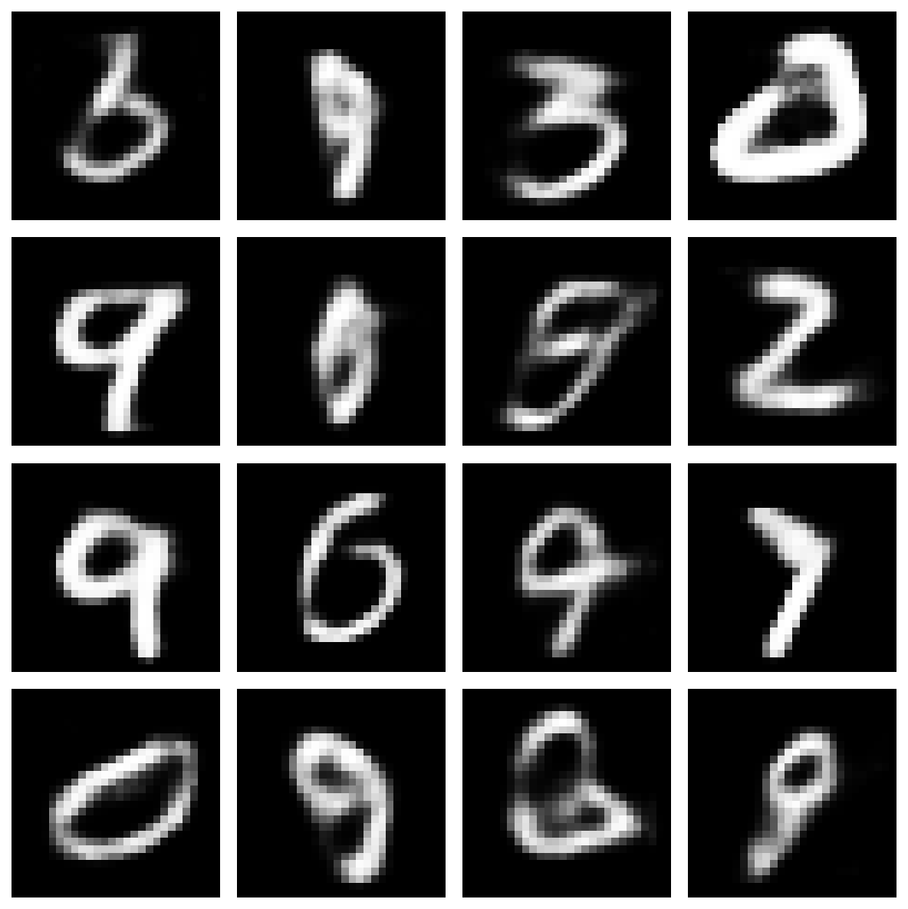
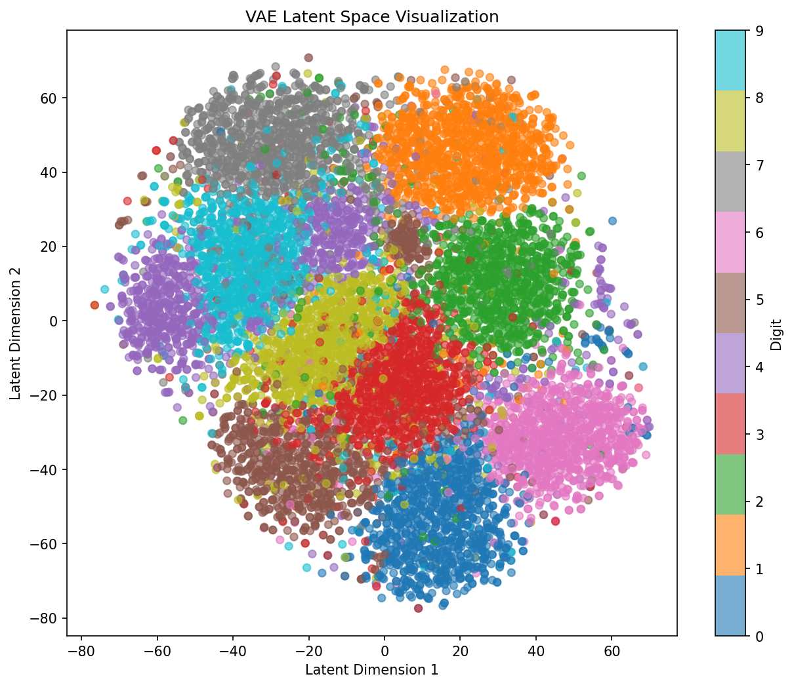

# Exercício 4 - Variational Autoencoder (VAE)

## O que foi feito

Implementei um Variational Autoencoder (VAE) do zero usando PyTorch no dataset MNIST. O objetivo era entender como funcionam esses modelos generativos, que conseguem não só reconstruir imagens como também gerar novas amostras sinteticamente.

## Como funciona a arquitetura

### O Codificador

O codificador pega uma imagem e a comprime em um vetor latente com distribuição gaussiana. A ideia é que ele não só codifique a informação, mas também nos diga a probabilidade de cada característica.

```python
class Encoder(nn.Module):
    def __init__(self, latent_dim=20):
        super(Encoder, self).__init__()
        self.fc1 = nn.Linear(784, 512)
        self.fc2 = nn.Linear(512, 256)
        self.fc_mu = nn.Linear(256, latent_dim)
        self.fc_logvar = nn.Linear(256, latent_dim)
        self.relu = nn.ReLU()
        
    def forward(self, x):
        h = self.relu(self.fc1(x.view(-1, 784)))
        h = self.relu(self.fc2(h))
        mu = self.fc_mu(h)
        logvar = self.fc_logvar(h)
        return mu, logvar
```

Basicamente: 784 (imagem achatada) → 512 → 256 → 20 dimensões latentes. Mantemos dois outputs: `mu` (média) e `logvar` (log da variância).

### O Decodificador

Faz o processo inverso. Pega um vetor latente e tenta reconstruir a imagem original:

```python
class Decoder(nn.Module):
    def __init__(self, latent_dim=20):
        super(Decoder, self).__init__()
        self.fc1 = nn.Linear(latent_dim, 256)
        self.fc2 = nn.Linear(256, 512)
        self.fc3 = nn.Linear(512, 784)
        self.relu = nn.ReLU()
        self.sigmoid = nn.Sigmoid()
        
    def forward(self, z):
        h = self.relu(self.fc1(z))
        h = self.relu(self.fc2(h))
        x_recon = self.sigmoid(self.fc3(h))
        return x_recon
```

### O "Truque" de Reparametrização

Para conseguir treinar com gradiente descendente através da amostragem aleatória, precisamos fazer:

```python
def reparameterize(self, mu, logvar):
    std = torch.exp(0.5 * logvar)
    eps = torch.randn_like(std)
    z = mu + eps * std
    return z
```

Em vez de simplesmente amostrar de uma distribuição, fazemos `z = μ + σ × ε`. Dessa forma os gradientes conseguem passar pela operação de amostragem.

## A função de perda

Tem dois termos que trabalham em tensão:

**1. Reconstrução (BCE)**: Queremos que a imagem reconstruída seja parecida com a original. Usar BCE aqui faz sentido porque estamos trabalhando com pixels no intervalo [0,1].

**2. Divergência KL**: Força o espaço latente a ser parecido com uma distribuição normal padrão N(0,1). Isso é o que torna o VAE especial - regulariza o espaço latente.

```python
def vae_loss(x_recon, x, mu, logvar):
    bce = nn.BCELoss(reduction='sum')
    reconstruction_loss = bce(x_recon, x.view(-1, 784))
    kl_loss = -0.5 * torch.sum(1 + logvar - mu.pow(2) - logvar.exp())
    return reconstruction_loss + kl_loss
```

A perda total é simplesmente a soma dos dois. Existem abordagens mais sofisticadas (como beta-VAE), mas essa versão simples já funciona bem.

## Dados e Treinamento

Usei MNIST - 60k imagens de treino, 10k de teste. Normalizei para [0,1] e dividi treino/validação em 80/20.

Treinei por 20 épocas com Adam e learning rate 1e-3. Nada de especial, só o padrão que funciona.

## Os Resultados

### Curva de Perda



A perda começa alta (~160) e cai rapidamente nos primeiros 5 epochs. Depois desacelera e converge em torno de 100-102. O fato da validação seguir o treino sem divergir muito é bom - significa não está fazendo overfitting grave.

---

### Reconstruções



Comparando original (primeira linha) com reconstruído (segunda linha): os dígitos são claramente reconhecíveis. Não é tão nítido quanto um Autoencoder padrão (que teria mais capacidade), mas tem esse aspecto "suavizado" típico de VAE. 

A razão é que o VAE sacrifica um pouco da qualidade de reconstrução em troca de um espaço latente bem organizado. Sem isso, não conseguiria gerar amostras decentes.

---

### Amostras Geradas



Aqui é onde o VAE mostra seu diferencial. Amostrando vetores aleatórios de uma distribuição normal, passando pelo decodificador, conseguimos gerar dígitos **completamente novos** que não estavam nos dados de treino.

Todos os 16 aqui são reconhecíveis como números. Nem sempre são perfeitos, mas mostram que o modelo realmente aprendeu a estrutura dos dígitos, não apenas memorizou.

---

### Espaço Latente



Essa é a parte mais legal. O espaço latente de 20 dimensões foi reduzido para 2D usando t-SNE. Cada cor é um dígito diferente.

Observe:

- Cada número forma um cluster bem definido
- Números similares ficam próximos (3 e 8, 4 e 9)
- Não há buracos ou discontinuidades abruptas
- Tudo forma um padrão quase circular

Se fosse um Autoencoder padrão, teria clusters espalhados aleatoriamente. O que torna isso possível é exatamente o termo KL divergence forçando continuidade.

---

## Comparação: VAE vs Autoencoder Padrão

| Aspecto | VAE | Autoencoder |
|---------|-----|------------|
| Espaço Latente | Estruturado e contínuo | Caótico |
| Consegue gerar? | Sim | Não |
| Regularização | Explícita (KL) | Nenhuma |
| Reconstrução | Um pouco desfocada | Muito nítida |

VAE é um trade-off. Perdemos um pouco em qualidade de reconstrução mas ganhamos um espaço latente interpretável e capacidade de geração.

